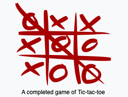
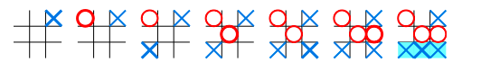

# Tic-tac-toe (Ruby)

 - About the game

*Tic-tac-toe* is a paper-and-pencil game for two players, X and O, who take turns marking the
 spaces in a 3×3 grid. The player who succeeds in placing three of their marks in a horizontal,
 vertical, or diagonal row is the winner. The following example game is won by the first player, X:

Players soon discover that the best play from both parties leads to a *draw*. Hence, tic-tac-toe is 
most often played by young children, who often have not yet discovered the optimal strategy.
Because of the simplicity of *tic-tac-toe*, it is often used as a pedagogical tool for teaching the
concepts of good sportsmanship or to write a computer program to play it. (WIKIPEDIA. Article:
Tic-tac-toe, 2020. Home page available in: <https://en.wikipedia.org/wiki/Tic-tac-toe>. 
Accessed on: June 17th. 2020.

 - About this project

In this project we tried to build a *tic-tac-toe* game on the command line where two human players can play against each other and the board is displayed in between turns. The aim of this exercise is to learn about the Object Oriented Programming by using *classes*, *Instances*, *Modules* and relationships between objects.

## Built With

- Ruby 2.6.5p114
- VSCode
- Linter : Rubocop

## Code testing
  - Tool : Rspec
  - Contributers :

      👤 **Angel Mora**
              - Github: [@angel-mora ](https://github.com/angel-mora)
              - Linkedin: [Angel Mora](https://www.linkedin.com/in/angelmoma/)

      👤 **Houda Cherkaoui**
              - Github: [@CalyCherkaoui](https://github.com/CalyCherkaoui)
              - Twitter: [@Houda59579688](https://twitter.com/Houda59579688)
              - Linkedin: [Houda-Cherkaoui](https://www.linkedin.com/in/houda-cherkaoui-64106395/)

## Getting Started

**Cloning a Git repository:**
 - From the repository, click + in the global sidebar and select Clone this repository under Get to work.
 - Copy the clone command (either the SSH format or the HTTPS). ...
 - From a terminal window, change to the local directory where you want to clone your repository.

**To start *tic-tac-toe* game:**

 - You need to have ruby installed on your machine.
 - run command ``git clone https://github.com/brugobi/Tic-Tac-Toe-Ruby.git`` to clone the repository
 - go into the folder containing the project by typing ``cd Tic-Tac-Toe-Ruby``
 - type in your terminal the command `` ruby bin/main `` or ``just bin/main``

## Authors

👤 **Houda Cherkaoui**

- Github: [@CalyCherkaoui](https://github.com/CalyCherkaoui)
- Twitter: [@Houda59579688](https://twitter.com/Houda59579688)
- Linkedin: [Houda-Cherkaoui](https://www.linkedin.com/in/houda-cherkaoui-64106395/)

👤 **Bruna Gobi**

- Github: [@brugobi](https://github.com/brugobi)
- Twitter: [@BrunaGobi2](https://twitter.com/BrunaGobi2)
- Linkedin: [bruna-gobi](https://www.linkedin.com/in/bruna-gobi/)

## 🤝 Contributing

Contributions, issues and feature requests are welcome!

## Show your support

Give a ⭐️ if you like this project!

## Acknowledgments

- Hat tip to anyone whose code was used
- Inspiration
- Microverse

## 📝 License

This project is [MIT](lic.url) licensed.
